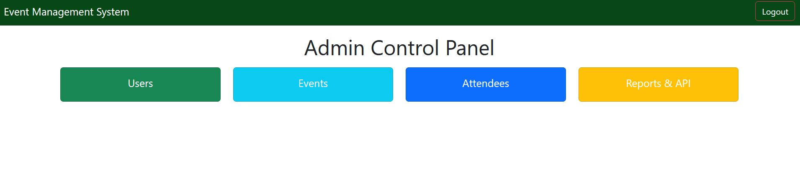
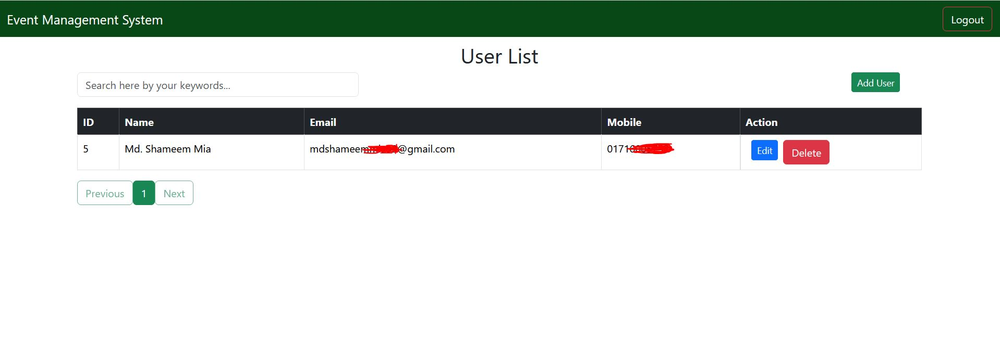
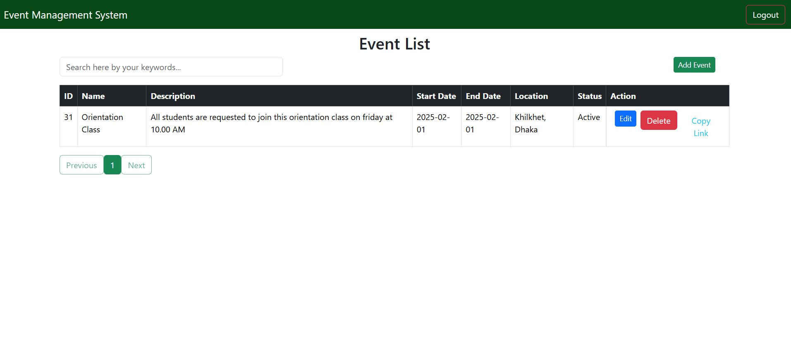
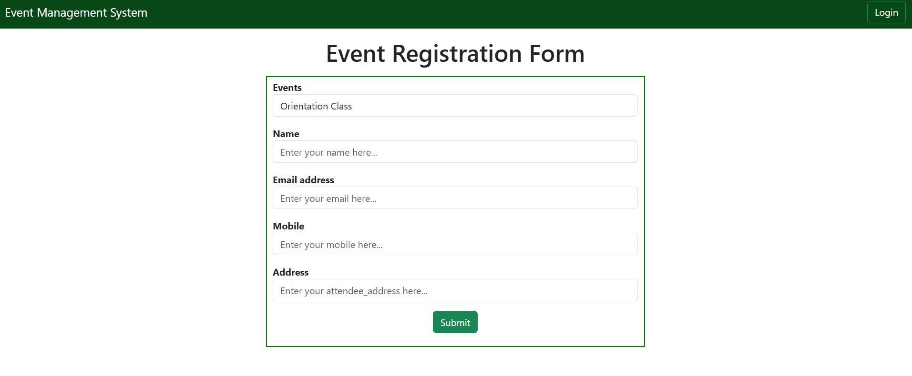
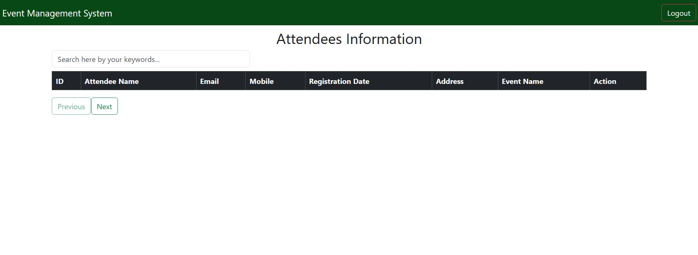
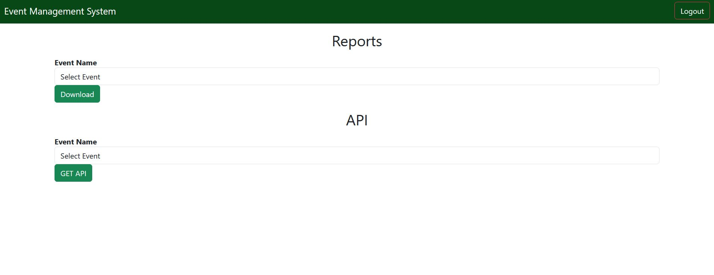

# Event Management System

## 🚀 Overview

Welcome to the **Event Management System**! This system allows authenticated users to efficiently manage and interact with events. Admins can create, update, view, and delete events, as well as manage users, attendees, and generate reports. The system also provides functionality for downloading reports and interacting with APIs for attendee information.

### 🔑 Key Features:

- **Create, Update, View, Delete Events**: Easily manage events with full control.
- **User Authentication**: Secure login system with password hashing.
- **Attendee Registration**: Users can register for events, with automatic capacity tracking.
- **Reports Generation**: Admins can generate and download attendee reports for each event.
- **Admin Dashboard**: A central dashboard for managing users, events, attendees, and reports.

---

## 💻 Login Credentials

To log in as an admin, use the following credentials:

**Admin Login:**
- **Email**: `mdshameemmia204@gmail.com`
- **Password**: `Sh@m33m##`

Visit the following URL to log in as an admin:  
[https://ems.rocklife-bd.com](https://ems.rocklife-bd.com)

Once logged in, the authenticated admin will have access to the following sections:
- **Users**
- **Events**
- **Attendees**
- **Reports & APIs**

---

## 🖼️ Screenshots

Below are screenshots for reference on what the admin will see after logging in.

### 🏠 **Dashboard View**  
This is the admin dashboard where you can access various features like Users, Events, and Reports.



---

### 👥 **Users View**  
In this section, admins can **create**, **update**, and **delete** users. The global search box allows you to search for users, and clicking on the **Name**, **Email**, or **Mobile** column sorts the user list in ascending or descending order.  
When there are multiple users, pagination will be shown after 5 entries.



---

### 🎉 **Events View**  
Admins can **create**, **update**, and **delete** events here. The global search box enables searching for events, and clicking the column fields will sort the event list in ascending or descending order.  
After 5 events, pagination will be activated.  
The "Copy Link" button allows admins to copy the event registration link directly to the clipboard for easy sharing.



---

### 📝 **Event Registration**  
Admins can attach event registration files here. Below is the screenshot of the registration file:



---

### 🧑‍🤝‍🧑 **Attendees Information**  
In this section, admins can view and delete attendee information. The global search box allows admins to search for attendees, and clicking column fields sorts the attendee list. Pagination will be shown after 5 entries.



---

### 📊 **Reports & APIs**  
Admins can download event attendee lists and get API details to retrieve attendee information along with event descriptions.



---

## 📋 Setup Instructions

### 🔧 Prerequisites:
Before setting up the system, make sure you have the following installed:
- **PHP (7.4 or higher)**
- **MySQL**
- **Web server (Apache or Nginx)**

### 1. Clone the Repository:

```bash
git clone https://github.com/yourusername/event-management-system.git
cd event-management-system
